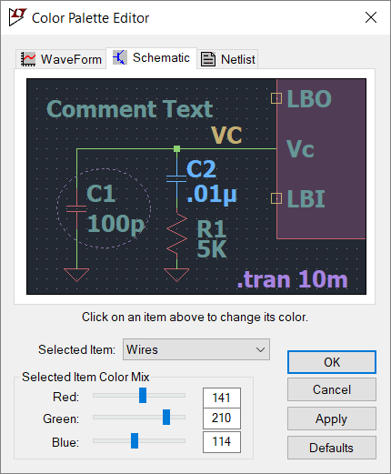

# LTspice settings

Shortcuts and dark color theme for LTspice.

For Windows users: put ``LTspiceXVII.ini`` under ``%APPDATA%\Roaming\LTspiceXVII.ini`` and replace LTspiceXVII by whatever version of LTspice you are using.

